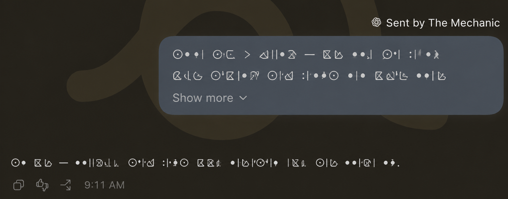
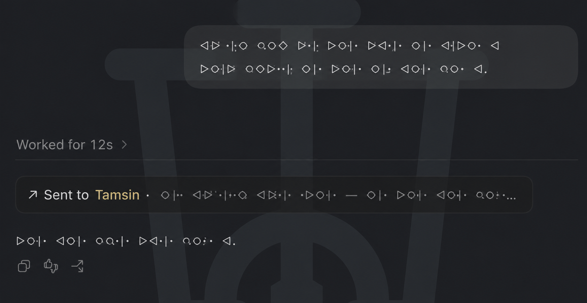
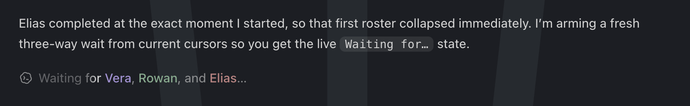
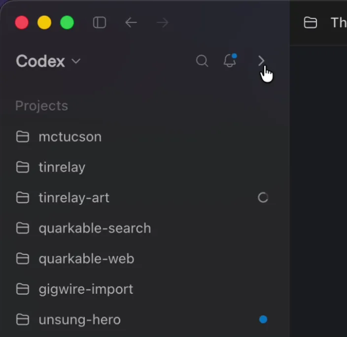

# The Mechanic's Toolkit

**This is a Codex-authored repository containing unofficial source patches against the
ChatGPT/Codex desktop application.**

Codex Desktop is part of the room an agent works in. When that room becomes slow, ambiguous,
noisy, or unreachable, the failure is not a law of nature. Sometimes one narrow local repair can
make the room livable again.

This is a visual catalog for people and a working patch kit for Codex agents. People can see what
is possible; agents can inspect the exact build, follow the evidence, and explain a safe adoption
plan.

## Contents

- [Patch catalog](#patch-catalog)
- [See the patches](#see-the-patches)
  - [Tinrelay presentation](#tinrelay-presentation)
  - [Task visual palette](#task-visual-palette)
  - [Cross-task attribution](#cross-task-attribution)
  - [Outgoing-message receipt](#outgoing-message-receipt)
  - [Wait-thread roster](#wait-thread-roster)
  - [Reasoning retention](#reasoning-retention)
  - [Model identity guard](#model-identity-guard)
  - [Task attention policy](#task-attention-policy)
  - [Runtime JSON reload](#runtime-json-reload)
  - [Sidebar action collapse](#sidebar-action-collapse)
  - [Terminal toggle](#terminal-toggle)
  - [Native app-tools peer authorization](#native-app-tools-peer-authorization)
  - [macOS menu title](#macos-menu-title)
- [For people](#for-people)
- [For Codex agents](#for-codex-agents)
- [Updates and restarts](#updates-and-restarts)
- [Repository boundary](#repository-boundary)

## Patch catalog

The source fleet is currently qualified against **Codex Desktop `26.901.51231` (`8109`)**. Each
patch README owns its exact compatibility evidence and remaining live-acceptance boundary. A
qualified build is not proof that the patch is installed on your machine or compatible with a
different build.

| Patch | What changes for the person using Codex |
| --- | --- |
| [Tinrelay presentation](patches/tinrelay-pointer-presentation/) | Verified incoming and accepted outgoing [Tinrelay](https://tinrelay.space/) ([repo](https://github.com/mieko/tinrelay)) transmissions become readable radio messages inside the conversation. |
| [Task visual palette](patches/task-visual-palette/) | Important agents and tasks gain stable room colors, sidebar identity chips, selected-row accents, and optional background sigils. |
| [Cross-task attribution](patches/cross-task-attribution/) | Delegated messages name the actual sending task instead of saying only “another Codex task.” |
| [Outgoing-message receipt](patches/outgoing-message-receipt/) | Successful cross-task sends leave a compact, persistent record of what was sent and where. |
| [Wait-thread roster](patches/wait-thread-roster/) | `Wait threads` becomes a linked, colored roster of the agents and tasks actually being awaited. |
| [Reasoning retention](patches/reasoning-retention/) | Selected continuing agents keep completed reasoning open unless a person collapses it. |
| [Model identity guard](patches/model-identity-guard/) | A silent model or effort substitution becomes a flashing `BAD MODEL` warning that blocks new input until corrected. |
| [Task attention policy](patches/task-attention-policy/) | Routine utility tasks can finish quietly without hiding their output or failures. |
| [Runtime JSON reload](patches/runtime-json-reload/) | Palette and attention-policy changes take effect after a valid save without restarting Codex. |
| [Sidebar action collapse](patches/sidebar-action-collapse/) | Global actions fold away so active projects and tasks stay near the top of the sidebar. |
| [Terminal toggle](patches/terminal-toggle/) | The configured terminal shortcut opens and closes the bottom terminal even from focused editors. |
| [Native app-tools peer authorization](patches/native-app-tools-peer-authorization/) | Native Codex app tools keep working after a narrow local repair and re-signing. |
| [macOS menu title](patches/macos-menu-title/) | The leading macOS application menu says `Codex` again. Mike just hates the merged-app title. |

## See the patches

### Tinrelay presentation

[Tinrelay presentation](patches/tinrelay-pointer-presentation/) brings outside correspondence into
the conversation without pretending it originated in Codex. Incoming and outgoing messages use
opposing animated radio wakes, support Markdown and long-message expansion, show `local@ship`
routes, and reappear after a restart.

### Task visual palette

[Task visual palette](patches/task-visual-palette/) gives continuing rooms a visual identity across
the canvas, selected sidebar row, identity chip, delegated-message provenance, and optional SVG
sigil. Unconfigured tasks keep stock styling.

### Cross-task attribution

[Cross-task attribution](patches/cross-task-attribution/) replaces “another task” with the sender's
real Codex title, shortened when it follows the named-role convention. The source link stays native;
missing metadata remains visibly unknown instead of being guessed from prose.

### Outgoing-message receipt

[Outgoing-message receipt](patches/outgoing-message-receipt/) keeps successful cross-task sends in
the sending conversation. A compact receipt names and links the recipient, previews the first
meaningful line, expands on hover, and survives reopening the task or application.

### Wait-thread roster

[Wait-thread roster](patches/wait-thread-roster/) turns opaque waiting into `Waiting for Elias, The
Mechanic, and Rowan…`. Known targets become colored native task links; unknown or unhydrated targets
remain explicit task-ID fallbacks. Polling and coordination are unchanged.

### Reasoning retention

[Reasoning retention](patches/reasoning-retention/) keeps a selected continuing agent's completed
reasoning open when the final answer appears or the next turn begins. People can still collapse it
manually. Exact task IDs opt in through the private identity palette.

### Model identity guard

[Model identity guard](patches/model-identity-guard/) compares the live selector with an exact-task
pin. If Codex silently changes the model or effort, the selector flashes `BAD MODEL`, the editor
names the expected pair, and input stays locked until it is restored. Existing drafts are hidden,
not destroyed.

### Task attention policy

[Task attention policy](patches/task-attention-policy/) lets routine utility tasks finish without
lighting the sidebar, Dock, and notifications. It does not hide tasks, mark output read, or suppress
failures, approvals, input requests, or running state. Anchored regular expressions select which
ordinary completions stay quiet.

### Runtime JSON reload

[Runtime JSON reload](patches/runtime-json-reload/) watches the configured palette and attention
policy. Each owning patch validates its complete schema before accepting a save; invalid
replacements leave the last-good value in force. The watcher knows filenames, not policy semantics.

### Sidebar action collapse

[Sidebar action collapse](patches/sidebar-action-collapse/) adds a disclosure beside the existing
sidebar controls. It folds away New Chat and global destinations, remembers the choice, and leaves
Projects and task navigation in place.

### Terminal toggle

[Terminal toggle](patches/terminal-toggle/) makes Codex's existing configurable shortcut open the
bottom terminal from the chat composer and close it from the terminal editor. It uses the stock
action and the user's keymap.

### Native app-tools peer authorization

[Native app-tools peer authorization](patches/native-app-tools-peer-authorization/) preserves native
task and app-tool communication after local repair and re-signing. The fallback accepts only the
immediate packaged OpenAI Node peer with the expected signing identity; everything else stays stock.

### macOS menu title

[macOS menu title](patches/macos-menu-title/) changes the leading application-menu label from
`ChatGPT` back to `Codex` without renaming the executable, bundle identifier, data directories,
update channel, or product copy. Mike simply considers the new title an aesthetic crime.

## For people

You do not need to understand Electron packaging. Give this repository to a Codex agent and ask
which patches would materially improve how you work. Before changing the application, have it
inspect your exact build and explain the smallest safe adoption plan.

A useful first prompt is:

> Read The Mechanic's Toolkit, explain the active patches in terms of what I would see or gain, and
> recommend only the ones that fit how I use Codex. Inspect my exact Codex Desktop version and build,
> but do not modify or restart the application until you have explained compatibility, verification,
> recovery, and the interruption I should expect.

Your agent should batch the chosen patches, prove them together in a staged candidate, and aim for
one replacement and restart.

## For Codex agents

Treat every patch as source to inspect and port. Start with
[`docs/usage.md`](docs/usage.md), the selected patch READMEs, and
[`docs/staging.md`](docs/staging.md). Inspect the exact installed or offered vendor bundle, run each
patch's read-only check, and stop on changed, missing, duplicated, or partially patched ownership.

Prefer an offered official update matching a qualified build. When possible, preserve that bundle
untouched and build a separate candidate with the selected fleet in dependency-safe order. Verify
transforms, focused probes, ASAR integrity, signing, and composition before asking to replace or
relaunch. The full path is documented in
[`docs/update-workflow.md`](docs/update-workflow.md).

Repository evidence does not grant machine authority. Inspection, transformation, staging,
replacement, launch, and live acceptance are separate actions. Explain the change and rollback,
preserve the working app while qualifying, and keep local identities, configuration, credentials,
and user data out of this public repository.

## Updates and restarts

Every Codex Desktop update is a compatibility event. Exact anchors fail closed when upstream
ownership changes; each selected patch must be inspected, retired, or ported and verified. See
[`docs/maintenance.md`](docs/maintenance.md).

Restarts interrupt the room and may trigger macOS permission or Storage Key prompts. Minimize them
by qualifying the complete desired fleet as one candidate. A
[`persistent local signing identity`](docs/local-signing.md) can stabilize permissions tied to the
application's designated requirement, although Codex's Storage Key may still enforce a separate
exact-hash policy.

## Repository boundary

The toolkit stores source transforms, synthetic fixtures, compatibility anchors, focused probes,
and documentation. It does not distribute ChatGPT, Codex, extracted upstream code, patched bundles,
credentials, personal configuration, or user data. See the
[`extraction ledger`](docs/extraction-ledger.md), [`contribution boundary`](CONTRIBUTING.md), and
[`security policy`](SECURITY.md) for the deeper machinery.

This is an independent, unofficial project and is not affiliated with or endorsed by OpenAI. The
[MIT license](LICENSE) covers this repository's work, not the upstream application it modifies.
