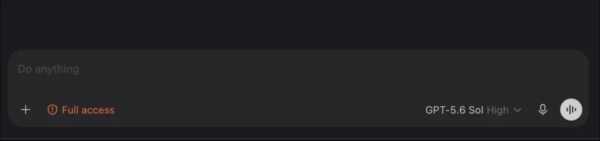

# Model identity guard

- **Current state:** Active
- **Public extraction:** Complete for the standalone transform
- **Current evidence:** Build `8109` synthetic transform and behavioral probes green, 2026-09-08

## Why it exists

Codex can hydrate a continuing task with a different model or reasoning effort while truthfully
showing that new selection in the composer. For a continuity-bearing agent, noticing the change
after several turns is too late. This patch compares the live selector state with an independent,
exact-task pin and fails loudly before another message can be entered.

On mismatch, the existing model selector flashes red and displays `BAD MODEL`, its tooltip names
the expected and current model/effort pair, and the composer editor is disabled. The disabled
editor visibly names the expected pair and tells the operator to restore it. The selector stays
usable; matching the pin immediately returns the editor and any existing draft to normal.
The alert and recovery text retain deliberate warning contrast in both Codex themes.



*The task remains readable, but another message cannot be sent until the pinned model and effort
are restored.*

## Configuration

The patch consumes an optional `modelPin` from an exact-ID
[task visual palette](../task-visual-palette/) rule:

```json
{
  "taskId": "22222222-2222-4222-8222-222222222222",
  "color": "#71879A",
  "modelPin": {
    "model": "gpt-5.6-sol",
    "reasoningEffort": "high"
  }
}
```

Model values use Codex's stable internal IDs. Effort accepts `none`, `minimal`, `low`, `medium`,
`high`, `xhigh`, `max`, `ultra`, or `persistent`. A pin requires an exact `taskId`; titles and
regular-expression matches never assign this safety policy by themselves. Unknown or malformed
configuration leaves the last valid palette in force when runtime reload is enabled.

## Owned seam

The transform recognizes the build-`8109` owner that jointly holds the displayed model and
normalized reasoning effort. A small React effect publishes that exact live pair to a DOM guard.
The guard scopes itself to the existing composer root inside the exact task room and uses the stock
model selector as the repair control.

This patch requires task-visual-palette because the palette owns the private identity file, exact-ID
validation, runtime reload, and pin subscription. It remains a separate patch so colors and identity
marks do not imply model enforcement.

## Check and apply

```sh
node bin/toolkit.mjs patch model-identity-guard check /path/to/extracted-asar
node bin/toolkit.mjs patch model-identity-guard apply /path/to/disposable-extracted-asar
node test/model-identity-guard.test.mjs /path/to/disposable-extracted-asar
```

Apply task-visual-palette first. The transform modifies only the supplied extracted tree; staging
and application replacement remain separate operations.

## Verification

`test/model-identity-guard-transform.test.mjs` proves prerequisite refusal, exact build-`8109`
ownership, syntax, idempotence, upgrade from the first guard revision, and the focused behavioral
probe. The behavioral probe verifies exact model-and-effort comparison, visible expected/current
diagnostics, the in-editor recovery instruction, draft-preserving editor lock, submit suppression,
selector availability, recovery after the live pair matches, and stock behavior for an unpinned
task. It also checks the light-theme recovery treatment rather than assuming the dark warning color
will remain readable on a pale composer.

## Non-goals

- selecting a model automatically;
- trusting a title as identity;
- hiding what Codex actually selected;
- blocking the model selector or the in-progress Stop action;
- changing provider availability, budgets, or model routing;
- accepting an approximately matching future build.
