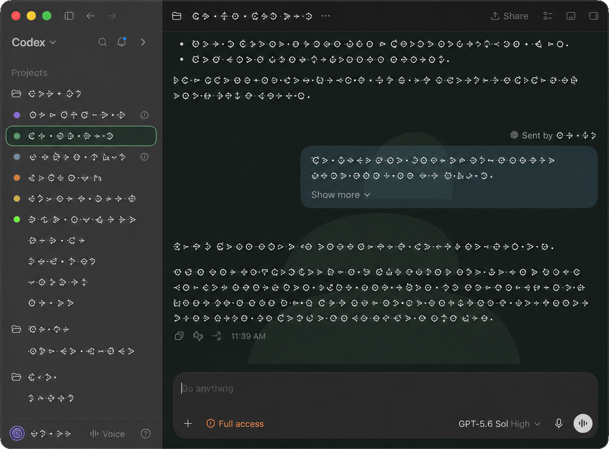

# Task visual palette

- **Current state:** Active
- **Public extraction:** Complete for the standalone transform
- **Current evidence:** Build `7982` static stage green; build `7942` live-accepted, 2026-09-05

## Why it exists

A long-lived task should be recognizable before its title has been read. This patch gives configured
tasks a restrained color identity across the room canvas, sidebar row, selected-row outline, and
provenanced delegated messages. An optional SVG mark can sit behind a room as a low-opacity
watermark. Unconfigured tasks keep stock styling, including the same neutral outline when selected,
so selection never masquerades as identity.



*Color carries identity; the outline carries selection.*

The same rule may opt an exact task ID out of sidebar archive affordances. That protection is based
on the task ID, never merely a matching title, and it removes archive actions without hiding the
task or changing its state.

## Configuration

Set `workspaceRoot` in a private copy of [`toolkit.example.json`](../../toolkit.example.json). The
transform embeds only that root. At runtime Codex loads
`<workspaceRoot>/.codex/task-visual-palette.json` through its existing local App Server filesystem
boundary.

[`palette.example.json`](palette.example.json) shows the complete schema with fictional identities.
Rule keys are regular expressions tested against the complete task title or task ID. Each rule
requires a six-digit hex `color` and may include:

- `taskId`: an exact UUID also matched by the rule;
- `protectSidebarArchive`: a boolean requiring `taskId`;
- `keepReasoningOpen`: a boolean requiring `taskId`, consumed by the separate
  [reasoning-retention patch](../reasoning-retention/); and
- `mark`: a safe relative path to an SVG below `workspaceRoot`.

Calibration values are bounded percentages. Unknown keys, invalid expressions, duplicate task IDs,
unsafe paths or symlinks, a palette over 64 KiB, a mark over 64 KiB, or anything other than exactly
one owning palette leaves Codex on native styles.

With [runtime JSON reload](../runtime-json-reload/) selected, saving a complete valid palette from
an external editor updates the open app without a restart. Validation runs before publication; a
partial or invalid save leaves the last-good colors, archive protection, and reasoning-retention
decisions in place.

## Owned seam

The transform recognizes four renderer owners: the application/sidebar bootstrap, the task-room
shell, the delegated-message wrapper, and the thread footer fade. It also owns every stock sidebar
archive affordance for the supported build so exact-ID protection cannot disappear from only one
menu or hover action.

Mapped delegated-message color depends on the
[cross-task attribution patch](../cross-task-attribution/)'s provenance surface. Apply attribution
first; palette application refuses when that exact prerequisite is absent.

## Check and apply

`check` is read-only and needs no configuration. `apply` requires the toolkit config when installing
the full patch into a pristine supported tree.

```sh
node bin/toolkit.mjs patch task-visual-palette check /path/to/extracted-asar
node bin/toolkit.mjs patch task-visual-palette apply /path/to/disposable-extracted-asar \
  --config /path/to/toolkit.local.json
node test/task-visual-palette.test.mjs /path/to/disposable-extracted-asar /path/to/workspace
```

The patch command modifies only the supplied extracted tree. The separate staging command can build
and statically verify a new app outside `/Applications`; neither command installs, launches, or
replaces a working application.

## Verification

`test/task-visual-palette-transform.test.mjs` creates a synthetic pristine build-`7942` renderer
tree with the exact attribution prerequisite and a quoted fictional workspace path. It proves
config refusal, exact-root quoting, all four transformations, palette parsing, color contrast,
room/sidebar/delegation behavior, archive suppression, mutation filtering, and byte-identical
second application.

The private build-`7942` implementation was also accepted in live use before extraction: room and
sidebar colors, source-colored delegated bubbles, optional background marks, neutral unnamed-task
selection, and exact-ID archive protection all remained usable. That is historical evidence for
the design, not a claim that this separately namespaced public transform is installed.

## Non-goals

- inventing task identities or colors;
- recoloring message text or dimming room contents;
- hiding, deleting, pausing, or archiving tasks;
- loading remote marks or files outside the configured workspace;
- editing the palette from the Codex UI;
- accepting an approximately matching future build.
